# 拟合FFT与LS对比

## 拟合方法采用Spline非参数法拟合

- **下图为缺失10个点时重构信号的结果**

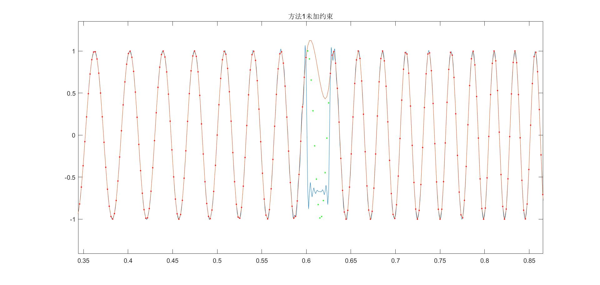

图中红色点为信号已知部分。绿色点为信号缺失部分，橘色线为拟合后结果，蓝色线段为FS重构结果

LS大体上重构了信号的波形但是有较多毛刺

- **下图为缺失10个点频域结果**

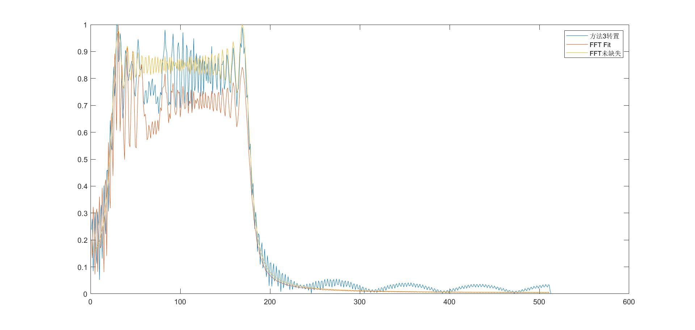

图中蓝线为LS结果，黄线为信号未缺失FFT理想结果，橘线为缺失拟合后FFT的结果

在信号频率观测区域LS的结果更接近理想FFT结果，缺失拟合FFT的结果低于理想结果，但是在高频区域，LS有波动干扰。

- **下图为缺失20个点时重构信号的结果**

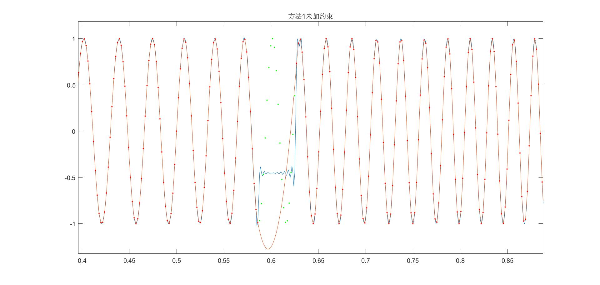

图中红色点为信号已知部分。绿色点为信号缺失部分，橘色线为拟合后结果，蓝色线段为FS重构结果

两种方法都不能很好的重构时域波形

**下图为缺失20个点频域结果**

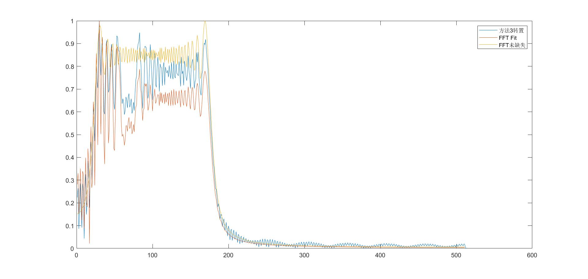

图中蓝线为LS结果，黄线为信号未缺失FFT理想结果，橘线为缺失拟合后FFT的结果

在信号频率观测区域LS的结果更接近理想FFT结果，缺失拟合FFT的结果低于理想结果，但是在高频区域，LS有波动干扰，但是相对于缺失10个点高频干扰减弱。

**下图为缺失40个点时重构信号的结果**

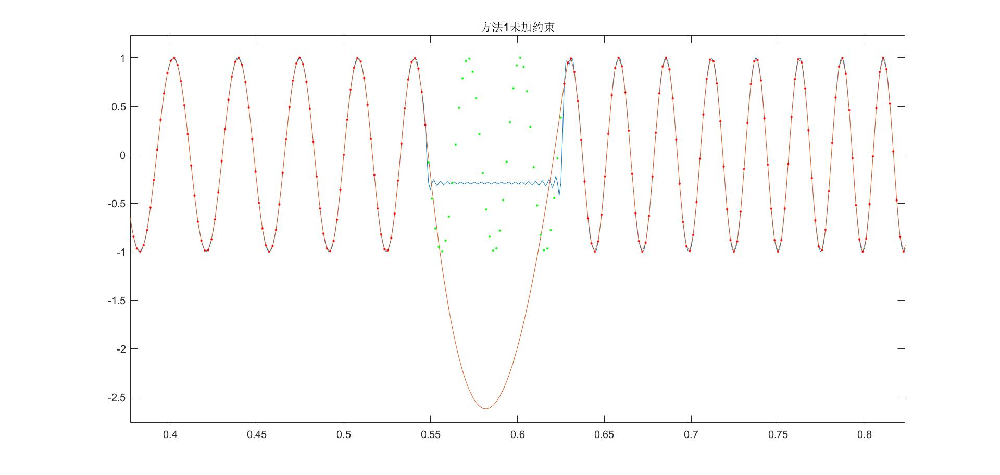

图中红色点为信号已知部分。绿色点为信号缺失部分，橘色线为拟合后结果，蓝色线段为FS重构结果

两种方法都不能重构时域波形

**下图为缺失40个点频域结果**

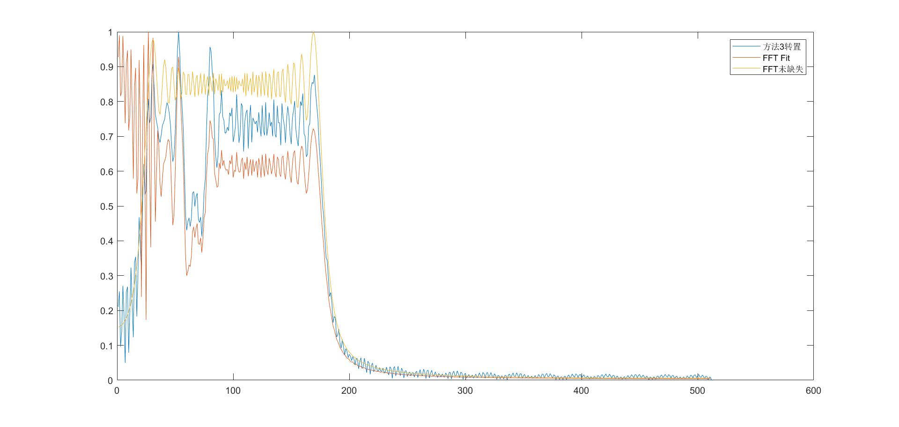

图中蓝线为LS结果，黄线为信号未缺失FFT理想结果，橘线为缺失拟合后FFT的结果

在信号频率观测区域LS的结果更接近理想FFT结果，缺失拟合FFT的结果在低频区域效果不佳，信号出现频段低于理想FFT结果

## 拟合方法采用Linear非参数法拟合

- **下图为缺失10个点时重构信号的结果**

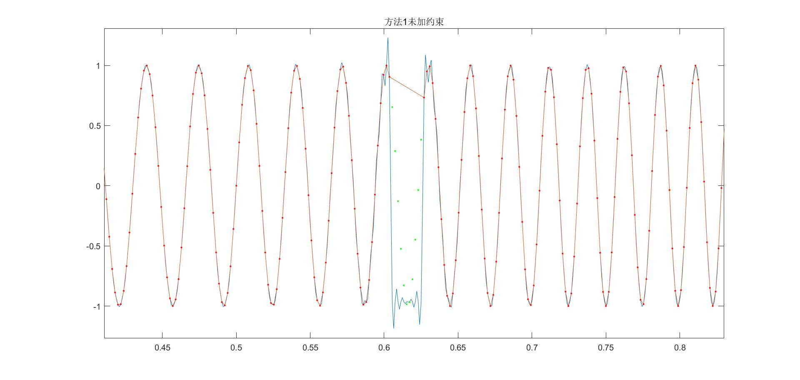

图中红色点为信号已知部分。绿色点为信号缺失部分，橘色线为拟合后结果，蓝色线段为FS重构结果

- **下图为缺失10个点频域结果**

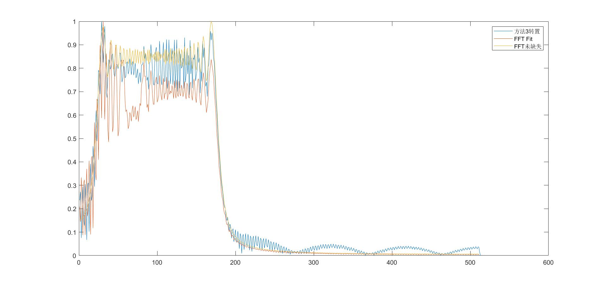

图中蓝线为LS结果，黄线为信号未缺失FFT理想结果，橘线为缺失拟合后FFT的结果

- **下图为缺失20个点时重构信号的结果**

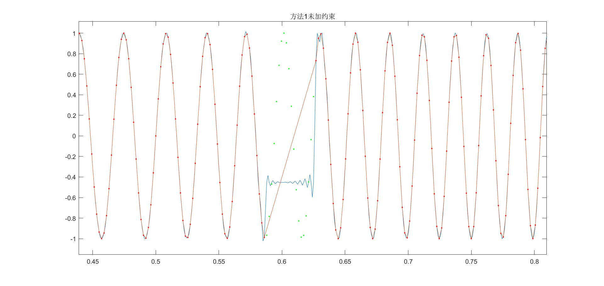

图中红色点为信号已知部分。绿色点为信号缺失部分，橘色线为拟合后结果，蓝色线段为FS重构结果

- **下图为缺失20个点频域结果**

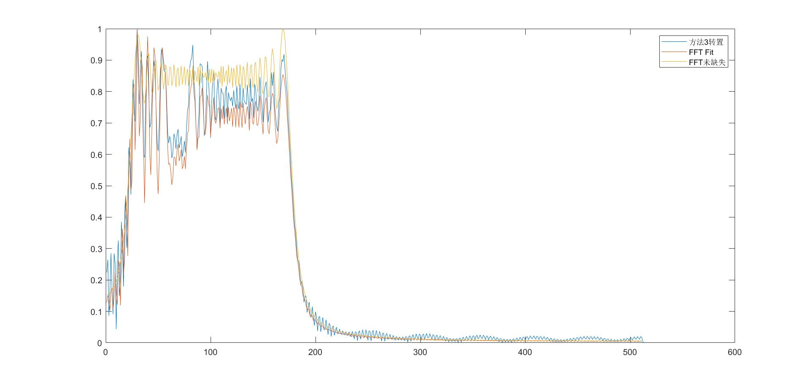

图中蓝线为LS结果，黄线为信号未缺失FFT理想结果，橘线为缺失拟合后FFT的结果

## 不缺失点情况

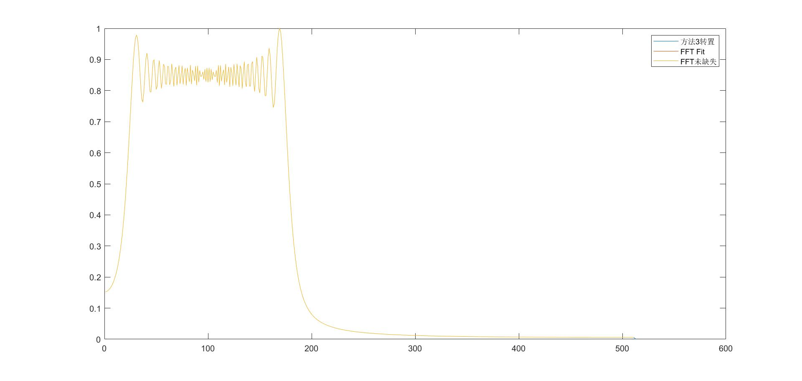

在不缺失点时LS效果与FFT相同